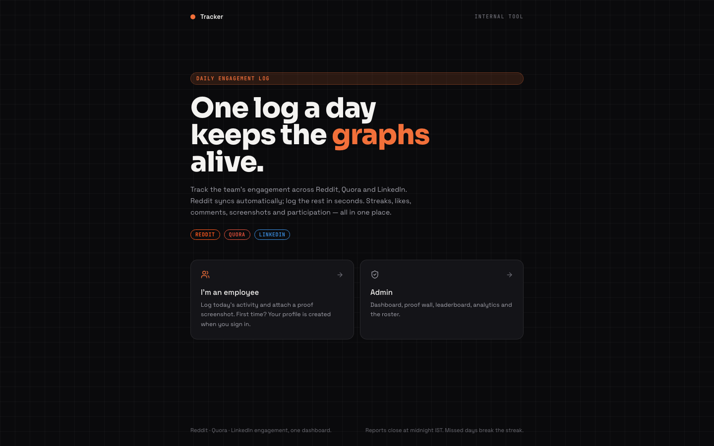

# Tracker

Mobile-first internal dashboard to track daily Reddit engagement activities of employees. Branded simply as "Tracker" — it is an internal tool, not a Reddit product. Employees log their activity in under 30 seconds; admins get KPIs, a team heatmap, leaderboards, and analytics.

**Live:** [reddit-tracker-beta.vercel.app](https://reddit-tracker-beta.vercel.app)



> Note: `reddit-tracker.vercel.app` (no `-beta`) is an unrelated third-party site — always use the link above.

## Tech Stack

| Layer | Technology |
|-------|-----------|
| Frontend | Next.js 16 + TypeScript |
| Styling | Tailwind CSS v4 |
| Animations | Framer Motion |
| Charts | Recharts |
| Icons | Lucide React |
| Database | Turso (libSQL) — free tier |
| Hosting | Vercel — free tier |

## Local Development

```bash
npm install
npm run dev
```

Without `.env.local` the app falls back to a local SQLite file (`local.db`). With `.env.local` present it talks to the live Turso database. Tables are created and a default admin (`Admin` / `admin123`) is seeded automatically on first request.

## Environment Variables

| Variable | Description |
|----------|-------------|
| `TURSO_DATABASE_URL` | `libsql://reddit-tracker-yogixt.aws-ap-south-1.turso.io` |
| `TURSO_AUTH_TOKEN` | Create with `turso db tokens create reddit-tracker` |
| `ADMIN_NAME` / `ADMIN_PASSWORD` | Optional — seeded on first request only (defaults `Admin` / `admin123`) |

## Deploy

```bash
vercel --prod
```

Set the env vars above in the Vercel project first (`vercel env add`). Schema is auto-created on first request; no migration step needed.

## Roles

- **Employee** — logs in with name + Reddit username (name must be in the roster), sees streak/likes/comments/reports, submits one report per day (IST).
- **Admin** — logs in with name + password; dashboard (KPIs, heatmap, today's table), leaderboard, analytics (30-day daily chart, weekly aggregates), employee management.

## API Routes

| Endpoint | Method | Description |
|----------|--------|-------------|
| `/api/employees` | GET / POST | List / add employees |
| `/api/submissions` | GET | Today's submissions; `?all=true` for all; `?name=X` for personal stats |
| `/api/submissions` | POST | Submit daily activity (one per day) |
| `/api/analytics` | GET | KPIs, heatmap, leaderboard, daily + weekly charts |
| `/api/auth/employee` | POST | Validate employee name |
| `/api/auth/admin` | POST | Authenticate admin |
